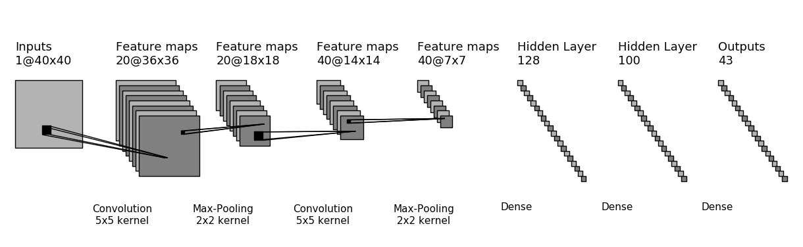

# GTSRB

## Structure des données : GTSRB/data/

Le dossier `data/Training` correspond à la base de données officielle de GTSRB.
Il est organisé en 43 sous-dossier de catégories, chacun contenant des images au
format `.ppm`.

Le dossier `data/validation` contient les 3000 labels et images et validation
sélectionnées dans celles de GTSRB, sous forme de tableaux numpy. Les images ont
été normalisées au format 40x40 et sont disposibles dans différents profils de
couleurs : `rgb`, `grey` et `clahe`.

Le dossier `data/train` contient les autres images et labels de GTSRB, sous
forme de tableaux numpy. Les images ont été normalisées au format 40x40 et sont
disposibles dans différents profils de couleurs : `rgb`, `grey` et `clahe`. Des
versions `ext` sont disposibles pour chaque profil : elles correspondent à
l'augmentation par symétries des bases de données.

	data
	├── noms_panneaux.npy
	├── Final_Test
	│	├── GT-final_test.csv
	│	└── Images
	│		├── 00001/
	│		├── ...
	│   	└── 00042/
	├── Final_Training
	│	└── Images
	│		├── 00001/
	│		├── ...
	│   	└── 00042/
 	├── rgb
 	│	├── test.pt
	│   ├── train.pt
	│   └── train_ext.pt
 	├── grey
 	│	├── test.pt
	│   ├── train.pt
	│   └── train_ext.pt
 	└── clahe
 	 	├── test.pt
	    ├── train.pt
	    └── train_ext.pt

	
### Construction de la base de données

- Télecharger et décompresser [Final_Training_Images.zip](http://benchmark.ini.rub.de/Dataset/GTSRB_Final_Training_Images.zip) dans le dossier `data/`

- Télecharger et décompresser [Final_Test_Images.zip](http://benchmark.ini.rub.de/Dataset/GTSRB_Final_Test_Images.zip) dans le dissier `data/`

- Télecharget et décompresser les étiquettes de Final_Test : [GT_final_train.zip](http://benchmark.ini.rub.de/Dataset/GTSRB_Final_Test_GT.zip) et le placer dans le dossier Final_Test.

- se placer dans le dossier `GTSRB/`

- Executer le script `gtsrb_test_reshape.py` pour obtenir une structure organisée en sous-dossiers de catégories dans `Final_Test/`

- Exécuter le script `gtsrb_lodader.py` avec les paramètres:
	- `couleur = grey`, `source = train`
	- `couleur = grey`, `source = test`
	- `couleur = clahe`, `source = train`
	- `couleur = clahe`, `source = test`

## Réseau à une convolution

Tous les entraînements sont réalisés avec 10 epochs, et une taille de paquet de
128, sur le même réseau.

La performance est à chaque fois mesurée sur la même base de validation.

- base `clahe`

| Epoch  |  1  |  2  |  3  |  4  |  5  | ... |   10    |
|--------|:---:|:---:|:---:|:---:|:---:|:---:|:-------:|
| Val. 1 |91.63|95.83|97.40|97.83|98.33| ... |**98.87**|
| Val. 2 |89.97|95.80|96.63|97.63|98.10| ... |**98.67**|
| Val. 3 |93.90|96.60|97.71|98.13|97.93| ... |**98.60**|

- base `clahe` étendue par symétries

| Epoch  |  1  |  2  |  3  |  4  |  5  | ... |   10    |
|--------|:---:|:---:|:---:|:---:|:---:|:---:|:-------:|
| Val. 1 |91.47|95.30|96.50|97.77|97.03| ... |**98.33**|
| Val. 2 |     |     |     |     |     | ... |         |
| Val. 3 |     |     |     |     |     | ... |         |

## Réseau à deux convolutions

, avec des dropout à 0.2 après chaque 
Pooling.

- base `clahe`

| Epoch  |  1  |  2  |  3  |  4  |  5  | ... |   10    |
|--------|:---:|:---:|:---:|:---:|:---:|:---:|:-------:|
| Val. 1 |     |     |     |     |     | ... |         |
| Val. 2 |     |     |     |     |     | ... |         |
| Val. 3 |     |     |     |     |     | ... |         |

- base `clahe` étendue par symétries

| Epoch  |  1  |  2  |  3  |  4  |  5  | ... |   10    |
|--------|:---:|:---:|:---:|:---:|:---:|:---:|:-------:|
| Val. 1 |94.30|96.90|98.23|98.47|98.80| ... |**98.80**|
| Val. 2 |89.30|95.63|96.97|97.80|97.87| ... |**98.77**|
| Val. 3 |     |     |     |     |     | ... |         |

