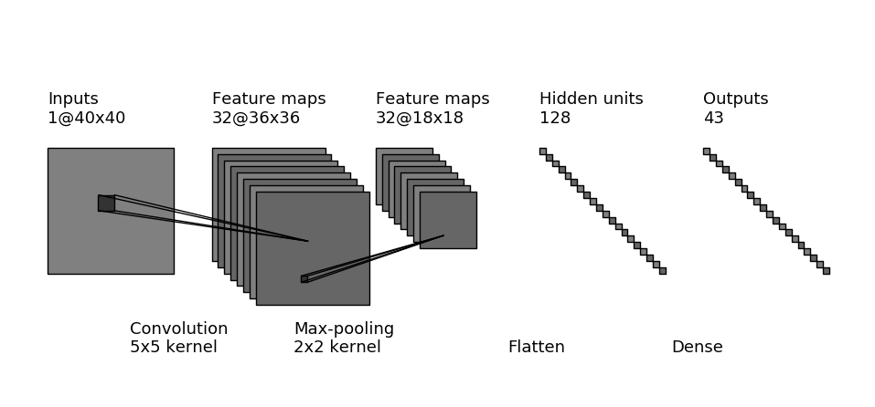

# GTSRB

## Structure des données : GTSRB/data/

Le dossier `data/Training` correspond à la base de données officielle de GTSRB.
Il est organisé en 43 sous-dossier de catégories, chacun contenant des images au
format `.ppm`.

Le dossier `data/validation` contient les 3000 labels et images et validation
sélectionnées dans celles de GTSRB, sous forme de tableaux numpy. Les images ont
été normalisées au format 40x40 et sont disposibles dans différents profils de
couleurs : `rgb`, `grey` et `clahe`.

Le dossier `data/train` contient les autres images et labels de GTSRB, sous
forme de tableaux numpy. Les images ont été normalisées au format 40x40 et sont
disposibles dans différents profils de couleurs : `rgb`, `grey` et `clahe`. Des
versions `ext` sont disposibles pour chaque profil : elles correspondent à
l'augmentation par symétries des bases de données.

	data/
	├── noms_panneaux.npy
	├── Training/
	│   ├── 00000/
	│   ├── ...
	│   └── 00042/
	├── train/
	│   ├── train_rgb.npy
	│   ├── train_grey.npy
	│   ├── train_clahe.npy
	│   ├── train_labels.npy
	│   ├── train_grey_ext.npy
	│   ├── train_clahe_ext.npy
	│   └── train_labels_ext.npy
	└── validation/
	    ├── train_rgb.npy
	    ├── train_grey.npy
	    ├── train_clahe.npy
	    └── train_labels.npy

Le dossier Final_Training/ est disponible à l'adresse suivante au format zip :
http://benchmark.ini.rub.de/Dataset/GTSRB_Final_Training_Images.zip

## Réseau utilisée

## Performances obtenues

Tous les entraînements sont réalisés avec 10 epochs, et une taille de paquet de
128, sur le même réseau.

La performance est à chaque fois mesurée sur la même base de validation, on
prend la meilleure performance sur trois lancers.

- base `grey`

	| Epoch  |  1  |  2  |  3  |  4  |  5  | ... |   10    |
	|--------|:---:|:---:|:---:|:---:|:---:|:---:|:-------:|
	| Succès |78.83|91.60|93.93|94.87|96.10| ... |**     **|

- base `grey` étendue par symétries

	| Epoch  |  1  |  2  |  3  |  4  |  5  | ... |   10    |
	|--------|:---:|:---:|:---:|:---:|:---:|:---:|:-------:|
	| Succès |     |     |     |     |     | ... |**     **|

- base `grey` étendue par symétries et distorsions

	| Epoch  |  1  |  2  |  3  |  4  |  5  | ... |   10    |
	|--------|:---:|:---:|:---:|:---:|:---:|:---:|:-------:|
	| Succès |     |     |     |     |     | ... |**     **|

- base `clahe`

	| Epoch   1  |  2  |  3  |  4  |  5  | ... |   10    |
	|------|:---:|:---:|:---:|:---:|:---:|:---:|:-------:|
	| Succès91.63|95.83|97.40|97.83|98.33| ... |**98.87**|

- base `clahe` étendue par symétries

	| Epoch  |  1  |  2  |  3  |  4  |  5  | ... |   10    |
	|--------|:---:|:---:|:---:|:---:|:---:|:---:|:-------:|
	| Succès |91.47|95.30|96.50|97.77|97.03| ... |**98.33**|

- base `clahe` étendue par symétries et distorsions

	| Epoch  |  1  |  2  |  3  |  4  |  5  | ... |   10    |
	|--------|:---:|:---:|:---:|:---:|:---:|:---:|:-------:|
	| Succès |     |     |     |     |     | ... |**     **|