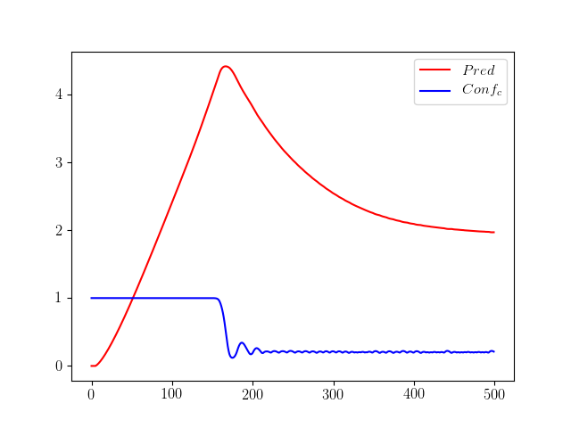
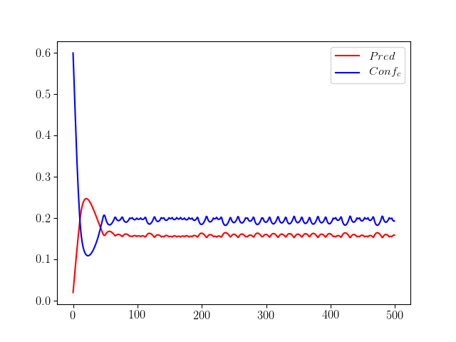
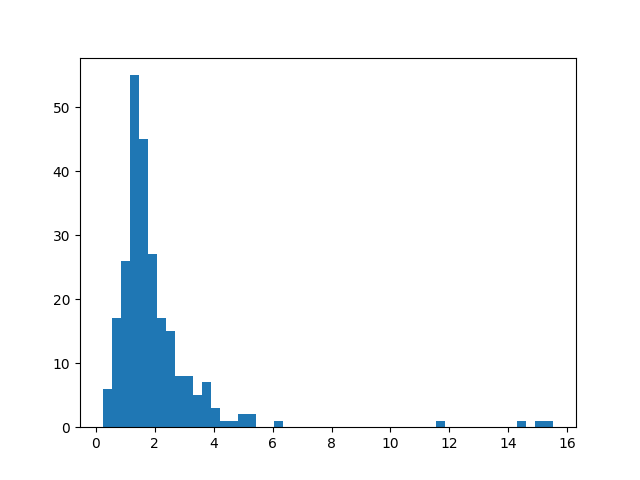
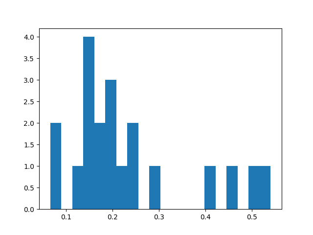

# Contre-attaques adversaires

## Introduction

## Les exemples adversaires

Les réseaux de neurones sont notoirement vulnérables aux attaques par *exemples adversaires* : il s'agit d'entrées inperceptiblement perturbées pour induire en erreur un réseau classificateur.

Plus concrètement, en considérant  la fonction qui à une image associe la prédiction du réseau, et en considérant une image  de , on cherche une perturbation  de norme minimale telle que :

Une méthode d'attaque possible est la suivante. Introduisons  la fonction qui à un couple  associe la probabilité (selon le réseau) que l'image appartienne à la catégorie donnée, et considérons une image  de catégorie . On cherche alors à minimiser par descente de gradient la fonction  suivante :

Cette première fonction est expérimentalement peu satisfaisante : l'attaque échoue souvent. Pour pallier celà, on "oblige" la perturbation à grossir avec un quatrième cas de figure, quand .

Cette deuxième fonction produit toujours un exemple adversaire pour un nombre d'étapes de descente de gradient suffisamment élevé (généralement 200 étapes suffisent).

Les fonctions  (en rouge) et  (en bleu) évoluent alors de la manière suivante, en fonction du nombre d'étapes de descente de gradient effectuées :

Qualitativement, la norme de la perturbation augmente jusqu'à ce que  passe en dessous de , à partir de quoi la norme diminue en gardant une valeur de  stabilisée autour de , ce qui s'explique par le choix de cette valeur comme seuil dans la fonction d'erreur.

Cette image peut être qualifiée de "difficile à attaquer" : il a été nécessaire d'augmenter très fortement la norme de la perturbation pour casser la prédiction du réseau, et la norme finale de la perturbation est élevée.

Par comparaison, l'image suivante peut être qualifiée de "facile à attaquer" : bien moins d'étapes ont été nécessaires pour casser la prédiction du réseau, et la norme finale est très basse.

## La résistance à une attaque

Pour chaque image, il est possible de quantifier la *résistance* du réseau : il s'agit de la norme minimale d'une perturbation mettant en échec le réseau :

Expérimentalement, les perturbations obtenues par la méthode précédente approche la valeur de  de manière satisfaisante, pour un nombre d'étapes suffisamment grand (autour de 500).

Ume image "facile à attaquer" aura donc une résistance faible, et inversement.

## La résistance comme indicateur de sûreté ?

Considérons un réseau de type  (CNN avec Dropout) appliqué au problème de la classification ds chiffres manuscrits de .

On constate expérimentalement que les images correctement classifiées par le réseau sont "difficiles" à attaquer : On a généralement . Avec 500 étapes, sur les 250 premières images de validation de , on obtient la répartition suivante :

À l'inverse, les images sur lesquelles le réseau se trompe sont faciles à attaquer, avec le plus souvent . Avec encore 500 étapes, sur les 20 premières images incorrectement classifiées par le réseau, on obtient la répartition suivante :

On peut donc conjecturer que la résistance est corrélée à la justesse de la classification : une classification correcte correspond à une résistance élevée, et inversement.

## Les contre-attaques adversaires

On observe un autre phénomène : si une attaque adversaire cherche à tromper le réseau, une attaque adversaire sur une image incorrectement classifiée va, le plus souvent, produire une image qui sera alors correctement classifiée ! Ce phénomène se produit en moyenne 80% du temps. On alors parle de *contre-exemple adversaire*.

Une contre attaque adversaire est donc une attaque adversaire sur une image incorrectement classifiée.

## Les contres-attaques adversaires comme méthode pour réduire l'erreur commise

Exploitons les deux phénomènes précédents pour tenter de reduire l'erreur commise par le réseau : Une attaque adversaire est tentée sur chaque image du réseau. Si la résistance est supérieure à un certain critère, on considèrera que la prédiction du réseau est correcte, et sinon on considèrera que le réseau prédit la nouvelle catégorie obtenue.

Avec les 270 images précédentes (250 justes, 20 erreurs), on obtient en fonction du critère choisi :

On passe ainsi de 20 erreurs à 8 erreurs avec un critère à  !

## Un affinement de cette méthode
