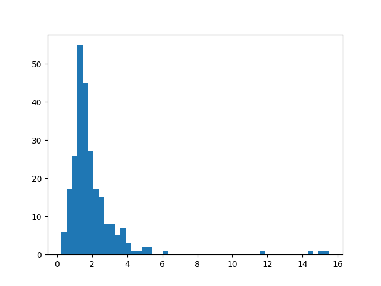
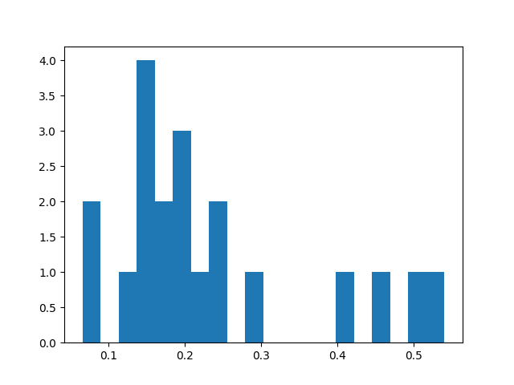

# Contre-attaques adversaires

## Introduction

## Les exemples adversaires
Les réseaux de neurones sont notoirement vulnérables aux attaques par *exemples adversaires* : il s'agit d'entrées inperceptiblement perturbées pour induire en erreur un réseau classificateur.

Plus concrètement, en considérant  la fonction qui à une image associe la prédiction du réseau, et en considérant une image  de , on cherche une perturbation  de norme minimale telle que :

Une méthode d'attaque possible est la suivante. Introduisons  la fonction qui à un couple  associe la probabilité (selon le réseau) que l'image appartienne à la catégorie donnée, et considérons une image  de catégorie . On cherche alors à minimiser par descente de gradient la fonction  suivante :

Cette première fonction est expérimentalement peu satisfaisante : l'attaque échoue souvent. Pour pallier celà, on "oblige" la perturbation à grossir avec un quatrième cas de figure, quand .

Cette deuxième fonction produit toujours un exemple adversaire pour un nombre d'étapes de descente de gradient suffisamment élevé (généralement 200 étapes suffisent).

Pour chaque image, il est possible de quantifier la *résistance* du réseau : il s'agit de la norme minimale d'une perturbation mettant en échec le réseau :

Expérimentalement, les perturbations obtenues par les méthodes précédentes approchent la valeur de  de manière satisfaisante.

## La résistance comme indicateur de sûreté ?

Considérons un réseau de type  (CNN avec Dropout) appliqué au problème de la classification ds chiffres manuscrits de .

On constate expérimentalement que les images correctement classifiées par le réseau sont "difficiles" à attaquer : On a généralement . Avec 500 étapes, sur les 250 premières images de validation de , on obtient la répartition suivante :

À l'inverse, les images sur lesquelles le réseau se trompe sont faciles à attaquer, avec le plus souvent . Avec encore 500 étapes, sur les 20 premières images incorrectement classifiées par le réseau, on obtient la répartition suivante :

Blabla

Avec les 270 images précédentes (150 justes, 20 erreurs), on bitient en fonction du critère choisi :

