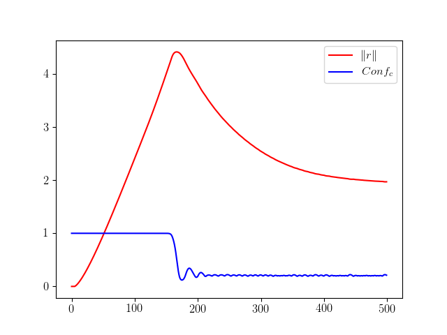
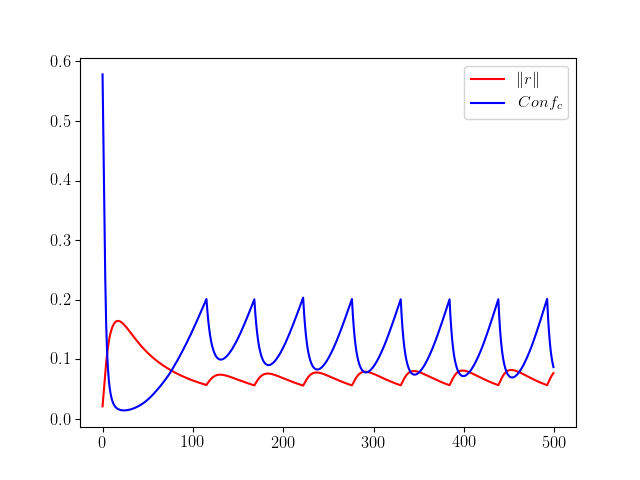
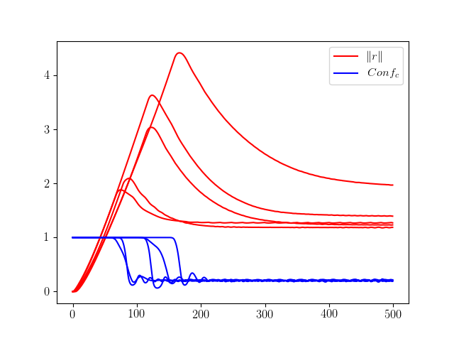
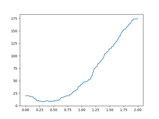

# Résistance aux attaques adversaires et contre-attaques adversaires

## Introduction

On introduit la notion de *résistance*, qui quantifie la difficilté à tromper un réseau de neurones classificateur avec un exemple adversaire créé à partir d'une image donnée. On cherchera d'abord plusieurs expressions possibles de la résistance, et on essaiera d'utiliser ce concept comme méthode pour détecter les exemples adversaires et améliorer la performance d'un réseau classificateur.

## 1. Les attaques adversaires

### 1.1 Les exemples adversaires

Les réseaux de neurones sont notoirement vulnérables aux attaques par *exemples adversaires* [1, 2] : il s'agit d'entrées inperceptiblement perturbées pour induire en erreur un réseau classificateur.

Plus concrètement, en considérant  la fonction qui à une image associe la prédiction du réseau, et en considérant une image  de  (c'est à dire à  pixels), on cherche une perturbation  de norme minimale telle que :

### 1.2 Les attaques adversaires

On cherche un algorithme qui détermine un exemple adversaire à partir d'une image donnée. On dit qu'un tel algorithme réalise une *attaque adversaire*.

Une méthode d'attaque possible est la suivante. Introduisons  la fonction qui à une image  associe la probabilité (selon le réseau) que l'image appartienne à la  catégorie  ; et soit une image  de catégorie . On cherche alors à minimiser par descente de gradient la fonction  suivante :

(*Note : on utilisera ici la norme euclidienne. D'autres normes sont évidemment possibles, mais sans amélioration sensible des résultats*)

Cette première fonction est expérimentalement peu satisfaisante, car l'attaque échoue souvent. La perturbation reste "bloquée" en , et n'évolue pas. Pour pallier celà, on oblige la perturbation à grossir en ajoutant un troisième cas de figure, quand , c'est à dire quand la perturbation n'est pas du tout satisfaisante :

Cette deuxième fonction produit presque toujours un exemple adversaire pour un nombre d'étapes de descente de gradient suffisamment élevé (généralement 200 étapes suffisent), et c'est celle-ci qui sera utilisée par la suite.

### 1.3 Quelques résultats

On réalise l'attaque adversaire en effectuant  étapes de descente du gradient de , avec un taux d'apprentissage .

Les fonctions  (en rouge) et  (en bleu) évoluent alors de la manière suivante, en fonction du nombre d'étapes de descente de gradient effectuées :

{width=60%}

Qualitativement, la norme de la perturbation augmente jusqu'à ce que  passe en dessous de , à partir de quoi la norme diminue en gardant une valeur de  stabilisée autour de .

Cette image peut être qualifiée de "difficile à attaquer" : il a été nécessaire d'augmenter très fortement la norme de la perturbation pour réussir à casser la prédiction du réseau, ce qui ne se produit qu'après un grand nombre d'etapes, et la norme finale de la perturbation est élevée.

L'image suivante, au contraire, peut être qualifiée de "facile à attaquer" : bien moins d'étapes ont été nécessaires pour casser la prédiction du réseau, la norme finale est très basse, et il n'y a pas eu de pic.

{width=60%}

On voit nettement ici l'influence de la valeur du seuil à  dans la fonction . Dès que  est en dessous de , l'algorithme a pour seul objectif de réduire la norme de la perturbation, et fatalement  repasse au dessus de . Il s'agit alors de réduire à la fois  et , jusqu'à ce que  repasse en dessous de ...

### 1.4 Un peu plus de résultats

La Figure 3 présente l'évolutions de  et de  los de l'attaque de 5 images "difficiles" à attaquer :

{width=60%}

Puis Figure 4, avec 5 images "faciles" à attaquer.

{width=60%}

Ici encore, on peut faire les mêmes observations :

|                                          | Images "faciles" | images "difficiles" |
| ---------------------------------------- | :--------------: | :-----------------: |
| Pic                                      |       Non        |         Oui         |
| Étapes nécessaires pour casser la prédiction |            |              |
| Norme de  finale                      |      Faible      |       Élevée        |

Pour quantifier plus précisément cette difficulté à attaquer une image, introduisons le concept de *résistance*.

## 2. La résistance 

### 2.1 La résistance à une attaque

Pour chaque image, on essaie de quantifier la *résistance* du réseau à une attaque adversaire. Plusieurs définitions sont possibles, par exemple la norme de la perturbation minimale mettant en échec le réseau :

(*Cette expression de la résistance n'est que d'un faible intérêt en pratique, car incalculable*)

On peut également utiliser comme valeur de la résistance la norme finale obtenue après un certain nombre d'étapes dans l'attaque adversaire précédente :

Ou bien la hauteur du pic de la norme de la perturbation :

Ou encore le nombre d'étapes qu'il a fallu pour abaisser  à :

### 2.2 Une corrélation avec la fiabilité de la prédiction ?

Les images attaquées dans la partie **1.4** n'ont pas été choisies au hasard : celles Figure 3 sont les 5 premières de la base de donnée (classifiées correctement par le réseau) , et celles Figure 4 correspondent aux 5 premières erreurs de classification commises par le réseau.

Considérons un réseau de type  (CNN avec Dropout) appliqué au problème de la classification ds chiffres manuscrits de . Ce réseau est entraîné avec  images, et sa performance évaluée sur  images de validation. Sur ces dernières, toutes sauf  sont classifiées correctement par le réseau.

Étudions la répartition des valeurs des résistances  et , d'abord sur 200 images correctement classifiées (notées **V**), puis sur les 84 incorrectement classifiées (notées **F**).

| Plage                    | V -  | F -  | V -  | F -  |
| :----------------------- | :---------: | :---------: | :-------------: | :-------------: |
|       |     0%      |   **41%**   |       0%        |       6%        |
|       |     3%      |   **48%**   |       1%        |     **68%**     |
|         |   **13%**   |     9%      |       3%        |     **19%**     |
|         |   **46%**   |     2%      |     **12%**     |       5%        |
|         |   **29%**   |     0%      |     **53%**     |       2%        |
|  |     9%      |     0%      |     **31%**     |       0%        |

Même étude sur la fonction  :

| Plage                    | V -  | F -  |
| :----------------------- | :-------------: | :-------------: |
|        |       0%        |     **12%**     |
|        |       4%        |     **77%**     |
|       |     **16%**     |       10%       |
|       |     **32%**     |       1%        |
|  |     **48%**     |       0%        |

Une corrélation se dessine nettement : les images correctement classifiées par le réseau sont très souvent de résistance bien plus élevée que les images sur lesquelles le réseau se trompe.

## 3. Les contre-attaques adversaires

On observe un autre phénomène : si une attaque adversaire cherche à tromper le réseau, une attaque adversaire sur une image incorrectement classifiée va, le plus souvent, produire une image qui sera correctement classifiée ! On parlera alors de *contre-exemple adversaire*.

Une contre attaque adversaire est donc une attaque adversaire sur une image incorrectement classifiée, dans l'espoir que la nouvelle catégorie soit la vraie.

Toujours avec le même réseau, sur les  erreurs commises,  des contre-attaques adversaires donnent la bonne catégorie, soit dans  des cas !

## 4. Une méthode pour réduire l'erreur du réseau ?

### 4.1 Un premier résultat

Exploitons les deux phénomènes précédents pour tenter de reduire l'erreur commise par le réseau : On on détermine la résistance de chaque image du réseau. Si la résistance est supérieure à un certain critère, on considèrera que la prédiction du réseau est correcte ; sinon on choisit comme prédiction le résultat de la contre-attaque adversaire.

Sur un lot de 270 images (250 justes, 20 erreurs), avec la fonction , on obtient le nombre d'erreurs commises en fonction du critère choisi.

{width=60%}

Tout à gauche, un critère à  nous donne naturellement  erreurs, puisque l'on n'a rien modifié aux prédictions du réseau.

Plus intéressant, avec un critère à , le réseau ne commet plus que 8 erreurs !

### 4.2 Une méthode qui se généralise difficilement

En appliquant cette méthode à l'ensemble de  images de validation de , on ne réussit qu'à faire passer le nombre d'erreurs de  à  dans le meilleur des cas. Ceci s'explique simplement : le nombre d'erreurs est proportionellement trop faible (moins de 1%), et donc les faux positifs, même si peu fréquents, vont annuler tout le gain obtenu.

Le choix arbitraire d'une fonction de résistance et d'un critère fixé n'est donc pas une méthode efficace dans ce cas.

### 4.3 Affinage de la méthode précédente

Plutôt que de s'arêter à un critère fixé, on peut affiner nettement ce résultat par une régréssion linéaire sur des valeurs de  au cours de l'attaque de chaque image.

(à compléter)

### 4.4 Un réseau de neurone pour calculer la résistance

 (à compléter)

## Bibliographie

[1] N. Srivastava, G. Hinton, A. Krizhevsky & al. JMLP, **Dropout: A Simple Way to Prevent Neural Networks from Overfitting.** Volume 15 (2014), Pages 1929-1958

[6] A. Krizhevsky, I. Sutskever & G. Hinton. NIPS'12 Proceedings, **ImageNet Classification with Deep Convolutional Neural Networks .** Volume 1 (2012), Pages 1097-1105