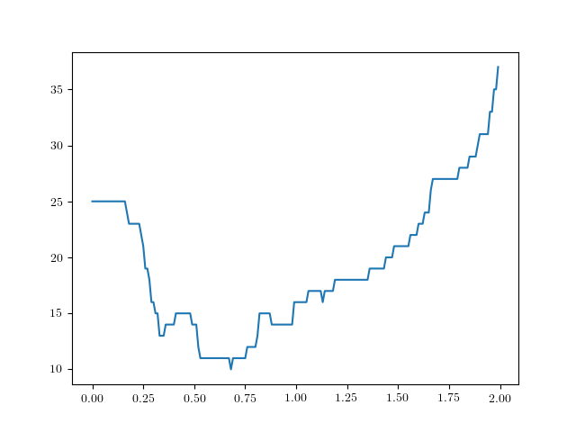

# La résistance aux attaques adversaires comme indicateur de sûreté

## Introduction

On introduit la notion de *résistance*, qui quantifie la difficilté à tromper un réseau de neurones classificateur avec un exemple adversaire créé à partir d'une image donnée. On cherchera d'abord plusieurs expressions possibles de la résistance, et on essaiera d'utiliser ce concept comme méthode pour détecter les exemples adversaires et améliorer la performance d'un réseau classificateur.

## 1. Les attaques adversaires

### 1.1 Les exemples adversaires

Les réseaux de neurones sont notoirement vulnérables aux attaques par *exemples adversaires* [1, 2] : il s'agit d'entrées inperceptiblement perturbées pour induire en erreur un réseau classificateur.

Plus concrètement, en considérant  la fonction qui à une image associe la prédiction du réseau, et en considérant une image  de , on cherche une perturbation  de norme minimale telle que :

### 1.2 Les attaques adversaires

On cherche un algorithme qui détermine un exemple adversaire à partir d'une image donnée. On dit qu'un tel algorithme réalise une *attaque adversaire*.

Une méthode d'attaque possible est la suivante. Introduisons  la fonction qui à une image de catégorie  associe la probabilité (selon le réseau) que l'image appartienne cette catégorie ; et soit une image  de catégorie . On cherche alors à minimiser par descente de gradient (avec un taux d'apprentissage ) la fonction  suivante :

Cette première fonction est expérimentalement peu satisfaisante, car l'attaque échoue souvent. La perturbation reste "bloquée" en , et n'évolue pas. Pour pallier celà, on oblige la perturbation à grossir en ajoutant un troisième cas de figure, quand , c'est à dire quand la perturbation n'est pas du tout satisfaisante :

Cette deuxième fonction produit toujours un exemple adversaire pour un nombre d'étapes de descente de gradient suffisamment élevé (généralement 200 étapes suffisent).

### 1.3 Quelques résultats

On réalise l'attaque adversaire en effectuant  étapes de descente du gradient de , avec un taux d'apprentissage .

Les fonctions  (en rouge) et  (en bleu) évoluent alors de la manière suivante, en fonction du nombre d'étapes de descente de gradient effectuées :

Qualitativement, la norme de la perturbation augmente jusqu'à ce que  passe en dessous de , à partir de quoi la norme diminue en gardant une valeur de  stabilisée autour de .

Cette image peut être qualifiée de "difficile à attaquer" : il a été nécessaire d'augmenter très fortement la norme de la perturbation pour réussir à casser la prédiction du réseau ; et la norme finale de la perturbation est élevée.

L'image suivante, au contraire, peut être qualifiée de "facile à attaquer" : bien moins d'étapes ont été nécessaires pour casser la prédiction du réseau, et la norme finale est très basse.

On voit nettement ici l'influence de la valeur du seuil à  dans la fonction . Dès que  est en dessous de , l'alogorithme a pour seul objectif de réduire la norme de la perturbation, et fatalement  repasse au dessus de . Il s'agit alors de réduire à la fois  et , jusqu'à ce que  repasse en dessous de ...

### 1.4 Un peu plus de résultats

D'abord 5 images "difficiles" à attaquer :

Puis 5 images "faciles" à attaquer.

Ces images n'ont pas été choisies au hasard : celles du haut sont les 5 permières de la base de donnée (sans erreurs), et celles du bas correspondent aux 5 premières erreurs de classification commises par le réseau.

Dans ces deux cas de figure, l'évolution de  est drastiquement différente. L'objectif de ce travail sera de mettre en évidence une possible corrélation entre la difficulté à attaquer une image (pic haut, norme finale élevée) et la justesse de la prédiction du réseau. On introduit pour cela le concept de *résistance*.

## 2. La résistance 

### 2.1 La résistance à une attaque

Pour chaque image, on essaie de quantifier la *résistance* du réseau. Plusieurs définitions sont possibles, par exemple la norme de la perturbation minimale mettant en échec le réseau :

On peut également utiliser comme valeur de la résistance la norme finale obtenue après un certain nombre d'étapes dans l'attaque adversaire précédente :

Ou bien la hauteur du pic de la norme de la perturbation :

Ou encore le nombre d'étapes qu'il a fallu pour abaisser  à :

### 2.2 Une corrélation avec la fiabilité de la prédiction ?

Considérons un réseau de type  (CNN avec Dropout) appliqué au problème de la classification ds chiffres manuscrits de , et utilisons les deuxième et troisième définition de la résistance :  et .

Observons la répartition des résistances, d'abord sur 200 images correctement classifiées (**V**), puis sur les 84 incorrectement classifiées (**F**):

| Plage                    | V -  | F -  | V -  | F -  |
| :----------------------- | :---------: | :---------: | :-------------: | :-------------: |
|       |     0%      |   **41%**   |       0%        |       6%        |
|       |     3%      |   **48%**   |       1%        |     **68%**     |
|         |   **13%**   |     9%      |       3%        |     **19%**     |
|         |   **46%**   |     2%      |     **12%**     |       5%        |
|         |   **29%**   |     0%      |     **53%**     |       2%        |
|  |     9%      |     0%      |     **31%**     |       0%        |

Effectuons la même étude sur la fonction  :

| Plage                    | V -  | F -  |
| :----------------------- | :-------------: | :-------------: |
|        |       12%       |                 |
|        |       77%       |                 |
|       |       10%       |                 |
|       |       1%        |                 |
|  |       0%        |                 |

Une corrélation se dessine : les images correctement classifiées sont en général de résistance plus élecée que les images sur lesquelles le réseau se trompe.

## 3. Les contre-attaques adversaires

On observe un autre phénomène : si une attaque adversaire cherche à tromper le réseau, une attaque adversaire sur une image incorrectement classifiée va, le plus souvent, produire une image qui sera correctement classifiée ! On parlera alors de *contre-exemple adversaire*.

Une contre attaque adversaire est donc une attaque adversaire sur une image incorrectement classifiée, dans l'espoir que la nouvelle catégorie soit la vraie.

Toujours avec le même réseau, observons les catégories obtenues par les contre attaques adversaires.

Sur les  erreurs commises,  des contre attaques adversaires donnent la bonne catégorie, soit dans  des cas !

## 4. Une méthode pour réduire l'erreur du réseau ?

Exploitons les deux phénomènes précédents pour tenter de reduire l'erreur commise par le réseau : Une attaque adversaire est tentée sur chaque image du réseau. Si la résistance est supérieure à un certain critère, on considèrera que la prédiction du réseau est correcte, et sinon on considèrera que le réseau prédit la nouvelle catégorie obtenue.

Avec les 270 images précédentes (250 justes, 20 erreurs), on obtient en fonction du critère choisi :

On passe ainsi de 20 erreurs à 8 erreurs avec un critère à  !

## 

## Bibliographie

[1] N. Srivastava, G. Hinton, A. Krizhevsky & al. JMLP, **Dropout: A Simple Way to Prevent Neural Networks from Overfitting.** Volume 15 (2014), Pages 1929-1958

[6] A. Krizhevsky, I. Sutskever & G. Hinton. NIPS'12 Proceedings, **ImageNet Classification with Deep Convolutional Neural Networks .** Volume 1 (2012), Pages 1097-1105