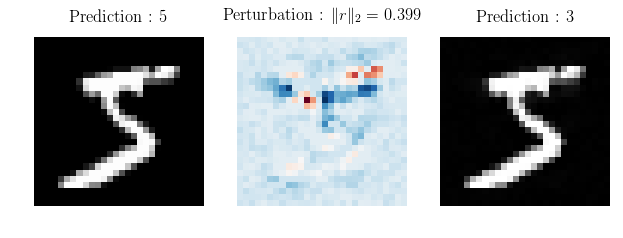
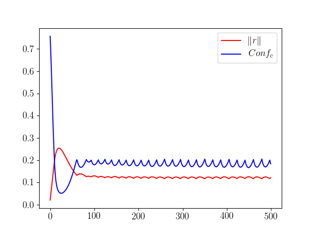
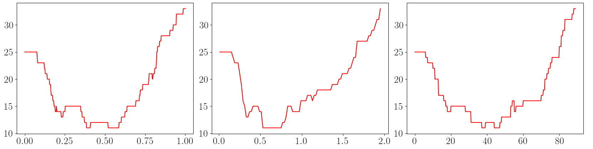

% Résistance aux attaques et corrections adversaires

## Résumé

Motivé par l'observation de deux phénomènes intéressants, les corrections adversaires et la corrélation de la difficulté d'une attaque avec la justesse de la prédiction du réseau, on cherche une méthode d'amélioration de la performance d'un réseau, et une méthode de détection des exemples adversaires. 

## 1. Les attaques adversaires

### 1.1 Les exemples adversaires

Les réseaux de neurones sont notoirement vulnérables aux *exemples adversaires* [1] : il s'agit d'entrées imperceptiblement perturbées pour induire en erreur un réseau classificateur.

Plus concrètement, en considérant $Pred$ la fonction qui à une image associe la catégorie prédite par réseau ; et en considérant une image $img$ de $[0, 1]^n$ (c'est à dire à $n$ pixels), on cherche une perturbation $r$ de norme minimale telle que :

1. $img + r \in [0, 1]^n$
2. $Pred(img+r) \neq Pred(img)$

Dans toute la suite, on utilisera la norme euclidienne. D'autres normes sont évidemment possibles, mais sans amélioration sensible des résultats.

### 1.2 Les attaques adversaires

On cherche un algorithme qui détermine un exemple adversaire à partir d'une image donnée. On dit qu'un tel algorithme réalise une *attaque adversaire*.

Une méthode d'attaque possible est la suivante. Introduisons $Conf_c$ la fonction qui à une image  associe la probabilité (selon le réseau) que l'image appartienne à la  catégorie $c$ ; et soit une image $img$ de catégorie $c$. On cherche alors à minimiser par descente de gradient la fonction $Loss_1$ suivante :

$$
Loss_1 =
\begin{cases}
  \Vert r \Vert                 & \text{si } Conf_c(img+r) \leq 0.2 \\
  Conf_c(img+r) + \Vert r \Vert & \text{sinon.}
\end{cases}
$$

Cette première fonction est expérimentalement peu satisfaisante car l'attaque échoue souvent : la perturbation reste "bloquée" en $0$, et n'évolue pas. Pour pallier cela, on oblige la perturbation à grossir en ajoutant un troisième cas de figure quand $Conf_c(img+r) > 0.9$, c'est à dire quand la perturbation n'est pas du tout satisfaisante :
$$
Loss_2 =
\begin{cases}
  \Vert r \Vert                 & \text{si } Conf_c(img+r) \leq 0.2 \\
  Conf_c(img+r) + \Vert r \Vert & \text{si } Conf_c(img+r) \leq 0.9 \\
  Conf_c(img+r) - \Vert r \Vert & \text{sinon.}
\end{cases}
$$

Cette deuxième fonction produit presque toujours un exemple adversaire pour un nombre d'étapes de descente de gradient suffisamment élevé (généralement 200 étapes suffisent), et c'est celle-ci qui sera utilisée par la suite.

La Figure 1 montre le résultat d'une attaque adversaire : à gauche l'image originale, au milieu la perturbation et à droite l'image adversaire.

On appellera $Pert_N$ la fonction qui à une image associe la perturbation obtenue après $N$ étapes de descente de gradient (avec un taux d'apprentissage $\eta = 10^{-3}$).

### 1.3 Réseau classificateur et base de données utilisé

On réalisera toute cette étude sur un réseau de type $\texttt{AlexNet}$ (CNN avec Dropout) [2, 3], appliqué au problème de la classification des chiffres manuscrits de $\texttt{MNIST}$.

La base de données $\texttt{MNIST}$ est divisée de la manière suivante :

- $50000$ images d'entraînement ($\texttt{train}$)
- $10000$ images de test ($\texttt{test}$)
- $10000$ images de validation ($\texttt{val}$)

Ce réseau est entraîné sur les images de $\texttt{train}$, et on travaillera systématiquement sur les images de $\texttt{test}$ par la suite, afin de travailler sur des images que le réseau n'a jamais vues. Les images de $\texttt{val}$ serviront à évaluer la généralisation des résultats obtenus à de nouvelles images.

Sur les $10000$ images de $\texttt{test}$, toutes sauf $89$ sont classifiées correctement par le réseau.

# 2. Les corrections adversaires

On un phénomène intéressant : si une attaque adversaire cherche à tromper le réseau, une attaque adversaire sur une image incorrectement classifiée va, le plus souvent, produire une image qui sera correctement classifiée ! On parlera alors de *correction adversaire*.

Sur la base de $\texttt{test}$, sur les $89$ erreurs de classification commises par le réseau, $80$ des corrections adversaires donnent la bonne catégorie, soit dans $90\%$ des cas. On a là un permier résultat intéressant : à partir du réseau précédent, d'erreur Top 1 de $0.89\%$, on obtient un classificateur d'erreur Top 2 de $0.09\%$.

On essaiera cependant d'aller plus loin, et de réduire directement l'erreur Top 1. Pour cela, on cherchera à identifier les images bien ou mal classifiées (évidemment sans connaître au préalable la vraie catégorie de l'image).

# 3. La résistance à une attaque

### 3.1 Images "faciles" et "difficiles" à attaquer

On réalise des attaques adversaires sur les images de $\texttt{test}$, en effectuant $500$ étapes de descente du gradient de $Loss_2$, avec un taux d'apprentissage $\eta = 10^{-3}$, et on s'intéresse aux valeurs prises par $\Vert r \Vert$ et $Conf_c$ au cours de l'attaque.

La Figure 2 a été obtenue en attaquant la première image de $\texttt{test}$.

{width=60%}

Qualitativement, la norme de la perturbation augmente jusqu'à ce que $Conf_c$ passe en dessous de $0.9$, à partir de quoi la norme diminue tout en gardant une valeur de $Conf_c$ stabilisée autour de $0.2$.

Cette image peut être qualifiée de "difficile à attaquer" : il a été nécessaire d'augmenter très fortement la norme de la perturbation pour réussir à casser la prédiction du réseau, ce qui ne se produit qu'après un grand nombre d'étapes, et la norme finale de la perturbation est élevée.

En attaquant une autre image, on a obtenu la Figure 3. Cette image peut alors au contraire être qualifiée de "facile à attaquer" : bien moins d'étapes ont été nécessaires pour casser la prédiction du réseau, la norme finale est très basse, et le pic de très faible amplitude.

{width=60%}

On voit nettement ici l'influence de la valeur du seuil à $0.2$ dans la fonction $Loss$. Dès que $Conf_c$ est en dessous de $0.2$, l'algorithme a pour seul objectif de réduire la norme de la perturbation, et fatalement $Conf_c$ repasse au dessus de $0.2$. Il s'agit alors de réduire à la fois $\Vert r \Vert$ et $Conf_c$, jusqu'à ce que $Conf_c$ repasse en dessous de $0.2$, etc.

D'autres exemples d'attaques d'images "faciles" ou "difficiles" à attaquer sont présentés dans l'Annexe A.

Résumons les principales différences qualitatives entre ces deux types d'images :

|                     | Images "faciles" | Images "difficiles" |
| ------------------- | :--------------: | :-----------------: |
| Pic                 | Absent ou faible |        Haut         |
| Étapes nécessaires  |  moins de $50$   |    plus de $200$    |
| Norme de $r$ finale |      Faible      |       Élevée        |

Pour quantifier plus précisément cette difficulté à attaquer une image, introduisons le concept de *résistance*.

### 3.2 Quantification de la résistance à une attaque

Pour chaque image, on essaie de quantifier la résistance, du réseau à une attaque adversaire. Plusieurs définitions sont possibles, par exemple la norme de la perturbation minimale mettant en échec le réseau :

$$
Res_\infty(img) = min \{\Vert r \Vert \; ; \; Pred(img+r) \neq Pred(img) \}
$$

Cette expression de la résistance n'est que d'un faible intérêt en pratique, car incalculable. C'est pourquoi on utilisera plutôt les trois définitions suivantes :

- $Res_N$ la norme finale obtenue après un certain nombre d'étapes dans l'attaque adversaire :

$$
Res_N(img) = \Vert Pert_N(img) \Vert
$$

- $Res_{max}$ la hauteur du pic de la norme de la perturbation :

$$
Res_{max}(img) = max\big\{\Vert Pert_N(img) \Vert \; ; \; N \in \mathbb{N}\big\}
$$

- $Res_{min}$ le nombre d'étapes qu'il a fallu pour abaisser $Conf_c$ à $0.2$ :

$$
Res_{min}(img) = min\big\{N \in \mathbb{N} \; ; \; Conf_c(Pert_N(img)) < 0.2\big\}
$$

### 3.3 Une corrélation avec la justesse de la prédiction

Les images attaquées dans l'Annexe A n'ont pas été choisies au hasard : celles du haut sont les 6 premières de de $\texttt{test}$, (classifiées correctement par le réseau) , et celles du bas correspondent aux 6 premières erreurs de classification commises par le réseau.

Essayons de voir si ces résultats se généralisent : on étudie la répartition des valeurs de la résistance, d'abord sur $250$ images correctement classifiées (notées **V**), puis sur les $89$ incorrectement classifiées (notées **F**) :

|                        | $Res_N$ | $Res_{max}$ | $Res_{min}$ |
| ---------------------- | :-----: | :---------: | :---------: |
| Premier décile (**V**) | $0.90$  |   $1.89$    |    $83$     |
| Dernier décile (**F**) | $0.75$  |   $1.09$    |    $58$     |

Dans les trois cas, le premier décile des images correctement classifiées est inférieur au dernier décile des images sur lesquelles le réseau se trompe ! Une corrélation se dessine donc nettement entre la résistance et la justesse de la prédiction du réseau.

## 4. Une méthode pour réduire l'erreur du réseau ?

### 4.1 Une première méthode...

Exploitons les deux phénomènes précédents pour tenter de réduire l'erreur commise par le réseau : On on détermine la résistance de chaque image du réseau. Si la résistance est supérieure à un certain critère, on considérera que la prédiction du réseau est correcte ; sinon on choisit comme prédiction le résultat de la contre-attaque adversaire.

Sur un lot de 275 images (250 justes, 25 erreurs), avec respectivement $Res_{N=500}$, $Res_{min}$ et $Res_{max}$, on obtient le nombre d'erreurs commises en fonction du critère choisi, Figure 4.

Avec des critères à $0$, on retrouve naturellement $25$ erreurs, puisque l'on n'a rien modifié aux prédictions du réseau.

En revanche, avec des critère respectivement à $0.4$, $0.685$ et $45$, le réseau ne commet plus que  $11$ erreurs.

### 4.2 ...peu efficace à grande échelle.

En appliquand les méthodes précédentes à l'ensemble de $10000$ images de $\texttt{test}$, on ne réussit qu'à faire passer le nombre d'erreurs de $89$ à $X$ dans le meilleur des cas. Le choix arbitraire d'une fonction de résistance et d'un critère fixé n'est donc pas une méthode efficace ici.

Ceci s'explique simplement : le nombre d'erreurs initial est proportionnellement trop faible (moins de 1%), et donc les faux positifs (images bien classées, mais considérées comme des erreurs par le critère), même si peu fréquents, vont annuler tout le gain obtenu.

# 5. Réseau discriminateur

Le choix arbitraire d'un critère et la représentation de la résistance par une seule valeur ne sont donc pas des méthodes efficaces pour réduire l'erreur du réseau. Essayons alors d'affiner la distinction entre les images correctement ou incorrectement prédites.

On s'intéresse ainsi maintenant à toutes les valeurs prises par $\Vert r \Vert$ et $Conf_c$ au cours d'une attaque, et on cherche à entraîner un réseau de neurones, dit *discriminateur*, à faire la distinction entre les images qui seront bien classifiées et celles qui seront mal classifiées.

(à continuer)

Pour évaluer la généralisation de cette nouvelle méthode, on l'applique sur les images de $\texttt{val}$, sur lesquelles on n'a toujours pas travaillé, que ce soit pour l'entraînement du réseau ou la détermination du critère.

(à continuer)

---

## Bibliographie

[1] C. Szegedy, I. Goodfellow & al. CoRR, **Intriguing Properties of Neural Networks.** (Déc. 2013)

[2] A. Krizhevsky, I. Sutskever & G. Hinton. NIPS'12 Proceedings, **ImageNet Classification with Deep Convolutional Neural Networks .** Volume 1 (2012), Pages 1097-1105

[3] N. Srivastava, G. Hinton, A. Krizhevsky & al. JMLP, **Dropout: A Simple Way to Prevent Neural Networks from Overfitting.** Volume 15 (2014), Pages 1929-1958

[4] Trouver un papier qui propose des vraies méthodes d'attaques

## A. Un peu plus de résultats

En Figure 5, les valeurs prises par $\Vert r \Vert$ et $Conf_c$ au cours de l'attaque de 6 images "faciles" à attaquer.

En Figure 6, même chose avec 6 images "difficiles" à attaquer.

## B. Calcul pratique de $Res_{N=500}$, $Res_{min}$ et $Res_{max}$