# Exemples adversaires

## Réseau ciblé

On cherche à tromper la prédiction du réseau suivant :

## Résultats

---

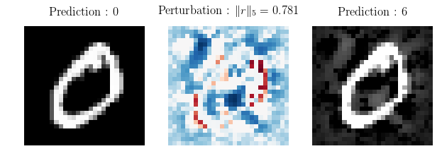
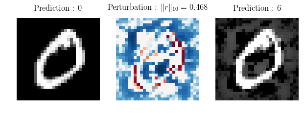

---

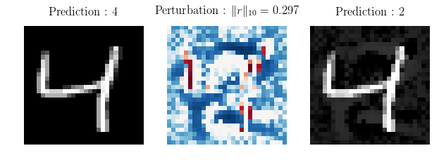

---

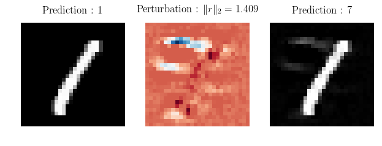
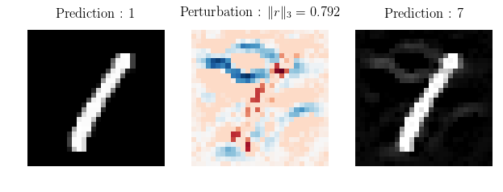
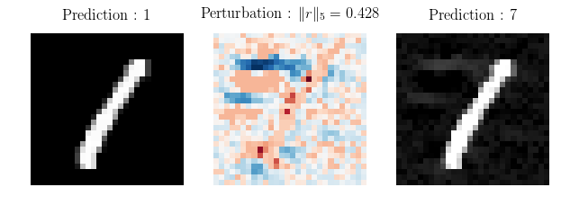
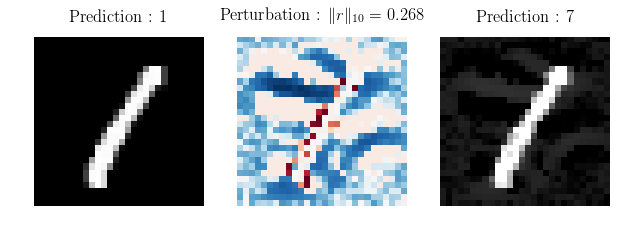

---

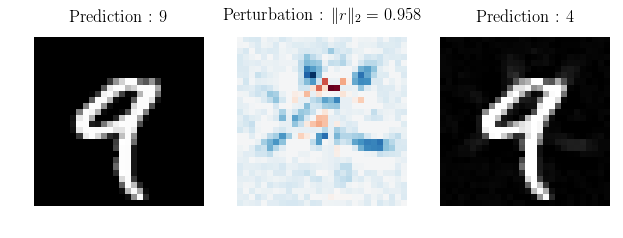

---

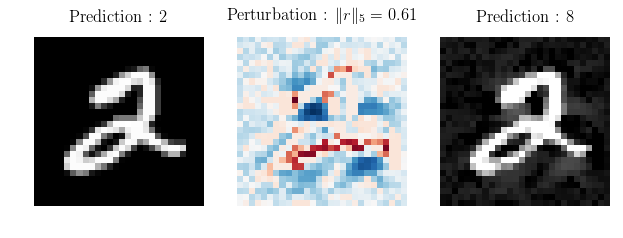

---

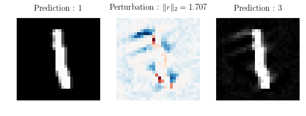

---

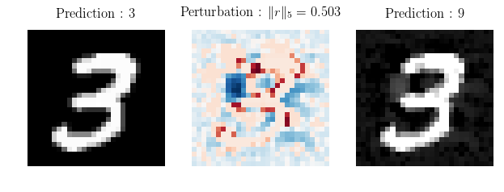
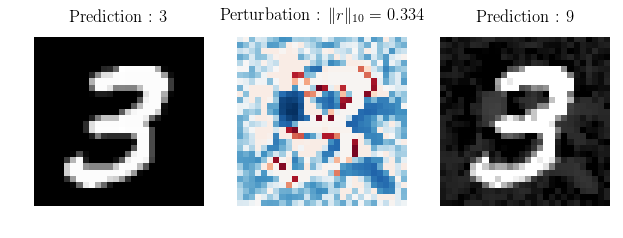

---

---

---

---

---

---

---

---

---

---

---

---

