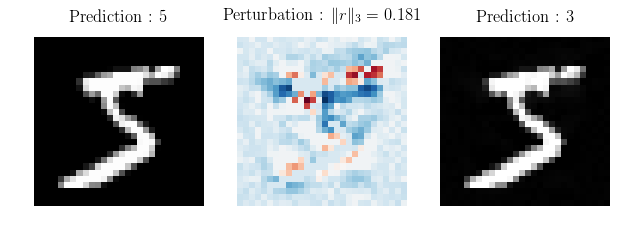

# Exemples adversaires

## Réseau ciblé

On cherche à tromper la prédiction du réseau suivant :

## Résultats

---l

---

---

---

---

---

---

---

---

---

---

---

---

---

---

---

---

---

---

---
